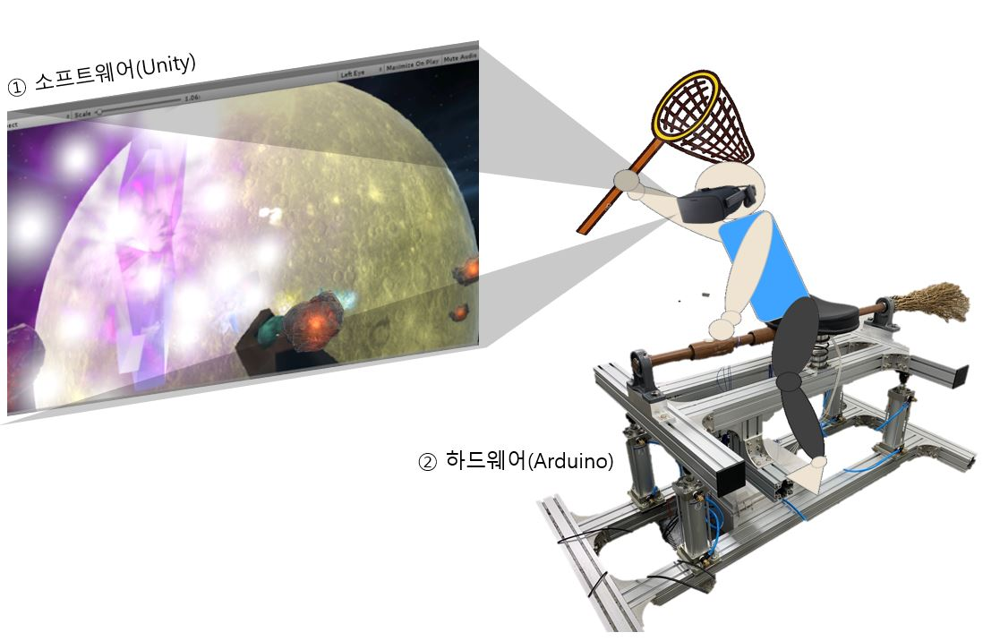

# :last_quarter_moon_with_face: ​별 따러 온 그대 

>  빗자루를 통해 공중을 비행하는 판타지적 환경의 체험과 더불어 장애물을 피하고,  별을 획득해 포인트를 얻는 방식의 게임

## 1. 작품 전체 모습

​	

 * 소프트웨어
    * 사용자가 보게 될 가상 현실을 구현
    * 하드웨어로부터 받은 신호(센서 값 등)으로, 가상 현실 내 사용자를 움직임
 * 하드웨어
    * 사용자가 탑승하게 될 장치를 제어
    * 빗자루의 손잡이에 부착된 압력센서 값에 따라 상하 움직임 신호를 Unity에 전송
    * 빗자루 안장에 부착된 자이로센서 값에 따라 좌우 움직임 신호를 Unity에 전송

## 2. 시연 & 설명 동영상

* https://www.youtube.com/watch?v=wbW45dIuFr4&t=32s

## 3. 소스코드

* git hub 용량을 초과하여 구글 드라이브에 업로드
* [2020ESWContest_free_1041 - Google Drive](https://drive.google.com/drive/folders/1n_OGDoIQfan4W8vJZi0yunpLkgdFYJZw)
* Unity 코드:  Flying Game_1.zip
* Arduino 코드: Hardware.ino

